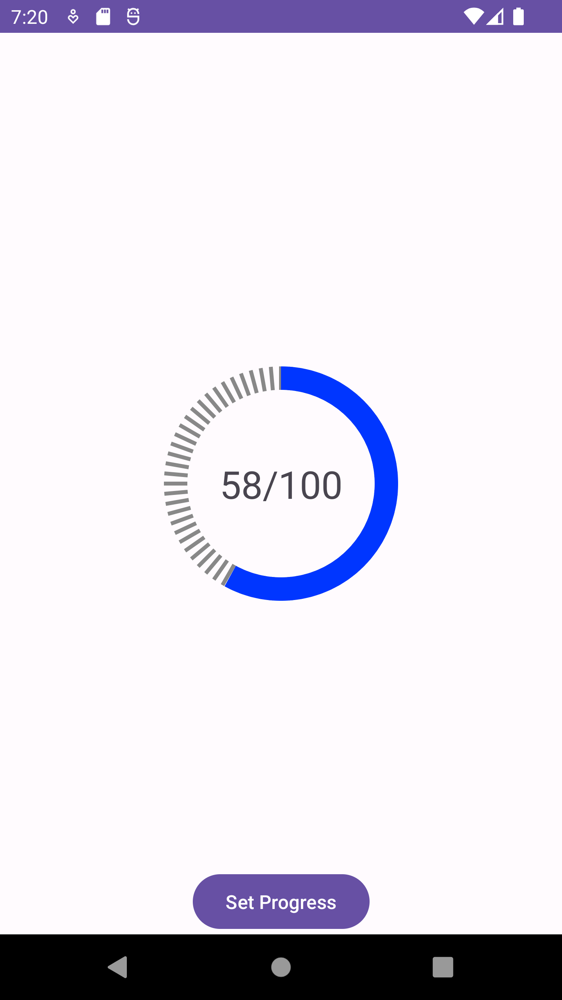

## DashPatternProgressBar

A custom circular progress bar with dash pattern background is designed using Canvas.

Custom attributes are provided for modifications like, size, width of fill progress, gap between dashes and thickness etc.

# Example:

```agsl
<com.app.dashpatternprogressbar.custom.CircularProgressBar
        android:id="@+id/circularProgressBar"
        android:layout_width="wrap_content"
        android:layout_height="wrap_content"
        app:layout_constraintBottom_toBottomOf="parent"
        app:layout_constraintEnd_toEndOf="parent"ō
        app:layout_constraintStart_toStartOf="parent"
        app:layout_constraintTop_toTopOf="parent"
        app:startAngle="270"
        app:size="300"
        app:trackWidth="60"
        app:percentageDivider="100"
        app:trackLineGap="5"
        app:trackLineThickness="10"/>
```

# Screenshot:

